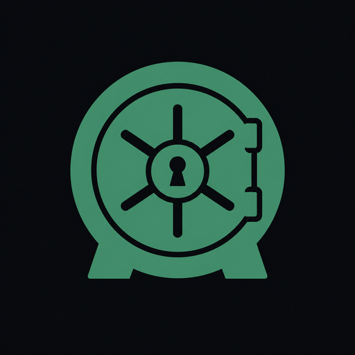
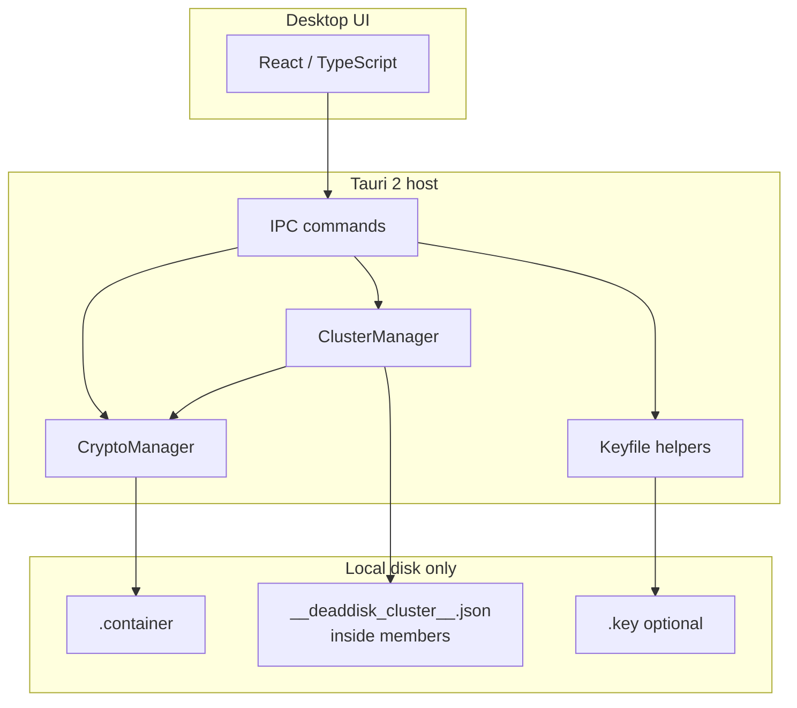
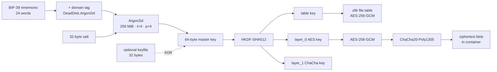

<p align="center">
  
</p>

<h1 align="center">Dead Disk</h1>

<p align="center">
  <strong>Your files. Your disk. Nobody else.</strong>
</p>

<p align="center">
  Offline encrypted vault for confidential data.<br>
  No cloud. No accounts. No telemetry.
</p>

<p align="center">
  <a href="#get-the-app"></a>
  
  
  
  
</p>

<p align="center">
  <em>This repository ships release builds only — installers and portable packages.</em>
</p>

---

## Why Dead Disk

| | |
|---|---|
| **Offline by design** | Vaults never leave your machine |
| **Strong crypto** | Dual AEAD + Argon2id, optional keyfile |
| **One phrase** | 24-word BIP-39 mnemonic unlocks everything |
| **Familiar tools** | Text, ASM, and HEX editors built in |

---

## Get the app

<p align="center">
  <strong>Installers live in GitHub Releases — not in the file tree.</strong><br>
  Open <b>Releases</b> (right sidebar or the link below) → download the asset for your OS.
</p>

<p align="center">
  <a href="https://github.com/MarshalV/DeathDisk_realise/releases/tag/latest"></a>
</p>

<p align="center">
  <sub>Windows: NSIS / MSI / portable · Linux: AppImage / deb · macOS: DMG</sub>
</p>

---

## What you get

- Encrypted **DEADDISK** containers (`.container`)  
- Add, extract, search, open files with their real extensions  
- **Clusters** — work with several containers as one set  
- File associations for `.container` / `.key` on Windows  
- UI in **English** and **Russian**

--
## Keep it safe

```text
  Your mnemonic = the only key to your data.
  Write it down. Store it offline. Never share it.
```

- Optional **keyfile** for a second factor on disk  
- A weak or leaked phrase will not protect anything  
- With a strong phrase, offline guessing is impractical  

---

## Architecture



Unlock and encrypt path:



---

## Container format (DEADDISK)

On-disk layout is big-endian. Magic is ASCII `DEADDISK` (8 bytes).

| Field | Type | Notes |
|-------|------|--------|
| `magic` | 8 bytes | `DEADDISK` |
| `salt_len` + `salt` | u32 + bytes | typically 32 bytes |
| `iv_len` + `iv` | u32 + bytes | typically 16 bytes |
| `hmac_key_len` | u32 | always **0** (key derived in memory only) |
| `encryption_layers` | u32 | **2** for dual AEAD |
| `table_len` + `table` | u32 + bytes | zlib JSON map `name → [offset, size]`, then AES-256-GCM (`nonce‖ct‖tag`) |
| `padding_size` + `padding` | u32 + random | 1024–8192 bytes of random padding |
| file payloads | … | each blob = dual AEAD ciphertext at table offsets |

No on-disk mnemonic hash — wrong credentials fail only after full KDF + AEAD authentication (no cheap password oracle).

Optional **keyfile** (`.key`): 32 raw bytes, or `salt(16) ‖ (key XOR PBKDF2-HMAC-SHA512(password))` (48 bytes). When used, the 32-byte key material is XORed into the Argon2id master key.

---

## Cryptographic scheme

| Layer | Algorithm | Role |
|-------|-----------|------|
| Secret | BIP-39, 256-bit entropy → 24 words | human-held secret |
| KDF | Argon2id, m=262144 KiB, t=4, p=4, out=64 | memory-hard unlock |
| KDF domain | `\|DeadDisk.Argon2id` appended to mnemonic bytes | domain separation |
| Subkeys | HKDF-SHA512 | `table`, `hmac`, `layer_0`, `layer_1` |
| File table | zlib → AES-256-GCM | authenticated directory |
| File data | AES-256-GCM, then ChaCha20-Poly1305 | cascade AEAD; fresh 12-byte nonce per layer |
| Auth check | AEAD decrypt of table / payloads | wrong mnemonic fails after full KDF cost |
| Rate limit | 5 unlock attempts / 60 s (in-process) | slows interactive guessing only |

Wrong credentials are rejected by AEAD authentication after paying the KDF cost — there is no fast on-disk password check.

---

## Performance

Informal microbench of the Rust crypto core (`cargo test --release`, dual AEAD path), measured once on a developer workstation. **Not** a formal product SLA; numbers vary with CPU, RAM pressure, disk, and build flags.

| Machine | Spec |
|---------|------|
| CPU | Intel Core i5-10600KF @ 4.10 GHz (6C/12T) |
| RAM | ~16 GiB |
| OS | Windows 11 |
| Build | release, fat LTO |

| Operation | Result |
|-----------|--------|
| Create 8 MiB container (includes Argon2id) | ~590 ms |
| Unlock (Argon2id + table AEAD), median of 3 | ~540 ms |
| Dual AEAD encrypt 1 MiB (in-memory) | ~490 MB/s |
| Dual AEAD decrypt 1 MiB (in-memory) | ~540 MB/s |
| Dual AEAD encrypt 8 MiB (in-memory) | ~480 MB/s |
| Dual AEAD decrypt 8 MiB (in-memory) | ~530 MB/s |
| `add_file` 1 MiB (encrypt + write) | ~10 ms |
| `get_file` 1 MiB (read + decrypt) | ~8 ms |

Unlock latency is dominated by Argon2id (by design). Throughput figures exclude that KDF cost.

---

## Security limitations and claims

**No external security audit** of Dead Disk has been published. Do not treat marketing language or this README as a certification, guarantee, or proof of resistance against nation-state or well-funded attackers.

Known limitations and honest boundaries:

- **Secret strength is yours.** A weak, reused, or leaked mnemonic defeats the cryptography regardless of Argon2id parameters.
- **Endpoint compromise.** Malware, a keylogger, a compromised OS, or physical access while the vault is unlocked can expose plaintext and secrets in memory. Offline-at-rest design does not equal runtime invulnerability.
- **No formal verification.** Cascade AEAD and custom container framing are engineering choices; they have not been independently reviewed.
- **In-process rate limiting only.** Limits apply inside a running app session; offline brute-force against a stolen container is bounded by Argon2id cost and your mnemonic entropy, not by the UI limiter.
- **Metadata leakage.** Container size, approximate file count (via size/padding heuristics), timestamps, and filesystem metadata are not a full anonymity suite. Random header padding reduces, but does not erase, structure hints.
- **Keyfile is not magic.** An unprotected 32-byte keyfile is just secret material on disk; a password-wrapped keyfile still depends on that password and file secrecy.
- **Obfuscation ≠ cryptography.** Release builds may strip symbols / obfuscate UI code to raise reverse-engineering cost; that does not strengthen the cipher suite.
- **Backup and recovery.** Lost mnemonic (and keyfile, if used) means permanent data loss. There is no backdoor or vendor recovery.

Use Dead Disk for offline confidentiality of files you control. For high-risk threat models, seek an independent audit and complementary controls (full-disk encryption, secure backup of the mnemonic, hardened endpoint).

---

## Disclaimer

Dead Disk is provided **as is**, without warranty of any kind — express or implied — including fitness for a particular purpose, merchantability, or non-infringement. The authors and contributors are **not liable** for any loss, damage, data loss, security breach, or other consequence arising from use or inability to use this software.

You alone are responsible for:

- choosing and safeguarding your mnemonic and any keyfile  
- verifying that Dead Disk fits your threat model and legal requirements  
- lawful use of the software and of any data you store in it  

Nothing in this README, the UI, or marketing copy constitutes a security certification, legal advice, or a guarantee of confidentiality under every threat model.

---

## License

MIT — use freely; your vaults remain yours.

<p align="center">
  <sub>Dead Disk · Confidential files, sealed on your machine</sub>
</p>
